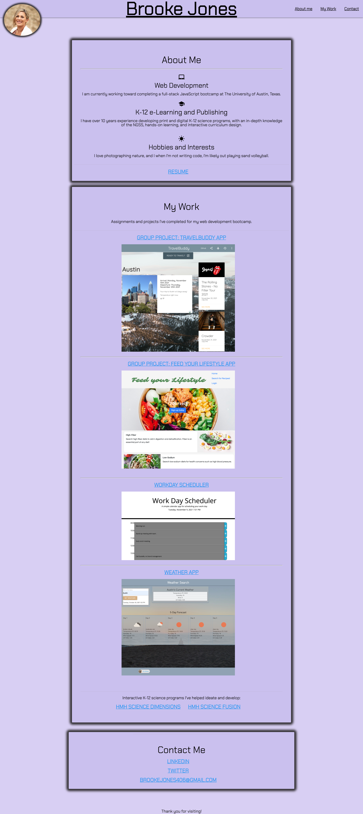

# Homework-2-Portfolio
UTA Bootcamp homework 2: Make a portfolio website from scratch. Include a header with links to various sections on my page: an "About Me" section, work samples, and contact information. Include images and links of work samples.
Updates throughout bootcamp: add resume and linkedin information.
Restyle page based on new skills.
Ensure page is responsive and clean.

HTML
I used some HTML starter code from Homework 1, as that was a responsive layout and included links that navigate within the webpage.

CSS
I copied and used one of the reset.css files from Unit 2.
I used information to style my images from https://www.w3schools.com/css/css_rwd_images.asp

I was assisted by my tutor to divide up my HTML more cleanly and better understand flexbox and responsive design in my CSS.

Responsive hamburger menu: https://www.youtube.com/watch?v=dIyVTjJAkLw

Completed Webpage:
